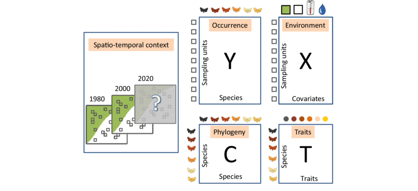

<br>

# Analyses multivariées - quelques bases!

## Que sont les analyses multivariées?

On utilise les analyses multivariées pour tester des prédictions dont la variable réponse (y) est composée de plusieurs vecteurs de données (plusieurs colonnes d'une matrice). L'objectif de ce type d'analyse est de comprendre les relations et les motifs qui existent parmi 

Tout comme pour les statistiques univariées où on retrouve notamment les régressions linéaires, les tests de t, les ANOVAs, etc., il existe plusieurs types d'analyses multivariées. Dans ce document, nous en verrons seulement quelques-unes qui devraient vous permettre de tester la plupart de vos prédictions lorsque les analyses univariées ne sont pas suffisantes.

<br>

## Analyses multivariées sur R

Un des package R couramment utilisé pour effectuer des tests sur des matrices de communauté est le package vegan (Jari et al. 2020). 

```{r, message = FALSE, warning = FALSE}
library(vegan)
```
<br>

## Matrice de communauté

En écologie, on utilise souvent des matrices de communauté: matrice d'abondance d'espèces végétales/animales/d'arthropodes, etc. ou matrice de présence-absence de ces espèces.

La différence principale entre une matrice et un *dataframe* est que la matrice ne contient qu'une seule classe de donnée, tandis que le *dataframe* en contient souvent plusieurs. Les lignes correspondent aux objets: il s'agit de l'unité d'échantillonnage où vous avez échantillonné votre communauté (site, parcelle, quadrat, etc.).
Les colonnes correspondent aux descripteurs: il s'agit de vos espèces (ou de vos familles, morphotypes, etc.). Dans chaque cellule, on retrouve l'abondance (nombre d'individus, recouvrement, etc.) ou la présence-absence (0 ou 1) de chaque espèce à chaque site.

Voici quelques exemples de structures de matrices (Ovaskainen et al. 2017):

<br>



<br>

Nous allons télécharger une base de données pour tester les différents types d'analyses. La base de données `varespec` décrit les recouvrements de différentes espèces de lichens dans des paturages (Väre et al. 1995).

```{r}
data(varespec)
head(varespec)
```
<br>

Ici, les sites ont été numérotés (nom des lignes) et les noms de colonnes correspondent aux noms scientifiques abrégés des espèces de lichens. L'information des cellules permet de connaître le recouvrement de chaque espèce à chaque site.

<br>

# Mettre vos données dans le bon format

Pour pouvoir utiliser vos matrices de communauté, vous devez vous assurer que vos cellules contiennent uniquement des données d'abondance. Les noms de vos sites doivent donc être en nom de lignes et non représentés à la première colonne de votre tableau. Ainsi, votre *dataframe* sera une matrice. Vous pouvez aussi convertir votre *dataframe* en format "matrix", mais les deux objets sont équivalents s'ils contiennent seulement des données d'abondance.

```{r}
class(varespec)
varesepc.matrix <- as.matrix(varespec)

class(varesepc.matrix)
```
<br>

Parfois, on aura besoin de remanipuler nos tableaux de données. Dans la librarie `picante`, la fonction `matrix2sample` convertit une matrice de communautés en un tableau de données format "long" (chaque ligne est une observation). La fonction `sample2matrix` fait le contraire.
```{r, message = FALSE, warning = FALSE}
library(picante)
varespec_long <- matrix2sample(varespec)
varespec <- sample2matrix(varespec_long)
```
<br>

De plus, les données d'abondances peuvent aussi être transformées en données binaires (présence-absence).
La fonction `decostand` de la librairie `vegan` permet de standardiser et de transformer les données compositionnelles de communautés. Nous reviendrons à cette fonction plus loin...
```{r}
varespec.pa <- decostand(varesepc.matrix, method="pa")
```
<br>

À partir d'une matrice de communauté, on peut aussi calculer des mesures de diversité alpha pour chaque site.
```{r}
richesse <- specnumber(varespec)
shannon <- diversity(varespec, index = "shannon")
# Mettre en tableau
diversite <- cbind(richesse, shannon)
```
<br>

On peut maintenant tester, par exemple, si les différentes mesures de diversité alpha diffèrent entre des groupes de communautés ou si elles sont corrélés à des variables environnementales... mais ça ce sont des analyses univariées...

<br>

# Questions nécessitant des analyses multivariées

Deux questions de recherche fréquentes:

Q1- Tester si les différences en composition d'espèces dans vos sites sont corrélées à des gradients environnementaux?

Q2- Tester si la composition en espèces diffère entre des groupes de sites? 

Différents types d'analyses existent pour différentes questions. Tout comme pour les statistiques univariées, vous devrez choisir le bon test (parmi toutes les méthodes qui existent) pour répondre à vos prédictions!
 
Autre exemple de question :
Tester si deux matrices d'abondances aux mêmes sites (ex. plantes et arthropodes) sont corrélées. Dans ce cas, vous pourriez faire des **tests Procrustes**. Nous ne verrons pas en détails ces tests ici, mais nous pourrons l'expliquer aux équipes intéressées.

Mais avant de répondre à nos questions, explorons visuellement nos données de composition des communautés!

<br>

# Les ordinations

Lorsqu'on s'intéresse à des communautés à différents sites, on est souvent intéressé à visualiser quels sites sont plus semblables ou plus différents en termes de composition d'espèce. Pour ce faire, on utilise souvent les ordinations. 

Nos **objets** (sites, parcelles) peuvent être "ordonnés" en fonction de leur ressemblance, dans un espace multidimensionnel, où chaque axe (dimension) représente un **descripteur** (ex. une espèce).

Les sites situés plus proches l'un de l'autre dans cet espace multidimensionel sont plus similaires dans leur composition en espèces que les sites situés plus loin. 

Or, cet espace comporte autant de dimensions que de descripteurs (espèces) et il est très difficile de représenter ou de visualiser un espace à plus de 3 dimensions!

--> L'ordination permet de trouver les deux ou trois axes de notre espace qui explique le plus de variation entre nos sites. Ces axes représentent une "combinaison de variables". L'ordination permet de visualiser l'espace multidimensionel en 2D et simplifie l'interprétation des données multivariées.


Note: Similairement, les ordinations permettent aussi d'ordonner les descripteurs (espèces) entre eux dans l'espace. Ainsi, deux espèces proches dans l'ordination se retrouvent plus souvent dans les mêmes sites que deux espèces éloignées. Ici, nous allons nous concentrer sur l'ordination des objets (sites), mais le principe est similaire avec les descripteurs (espèces).

Il existe différentes méthodes d'ordination: 
- l'analyse de correspondance (CA);
- l'analyse en composantes principales (PCA);
- l'analyse en coordonnées principales (PCoA);
- la mise à l'échelle multidimensionnelle non-métrique (nMDS; non présentée ici).

<br>

# L'analyse de correspondance (CA)

L'analyse de correspondance est une méthode d'ordination appropriée pour analyser des jeux de données contenant des espèces à distribution unimodale (par ex. dont l'abondance suir une distribution normale le long d'un gradient environnemental).

Les données qu'on fourni pour une CA sont sous forme de *matrice de communautés*, soit avec des **données d'abondances** brutes (sans pré-transformation) ou des **données binaires de présence-absence**.

Pour faire une ordination de type CA, toutes les données doivent être dans la même dimension physique (même unité) et ne pas contenir de données négatives, ni de NA.

Elle s'effectue en trois étapes dont voici le résumé (nous n'entrerons pas dans tous les détails ici):

1- Conversion de la matrice d'abondance (données brutes) en matrice Q de contributions de Pearson (calcul des **distances Chi2** entre objets). La table de contribution de Pearson contient l'information pour ordonner les sites dans l'espace multidimensionnel.

La distance de Chi2 exclut les **doubles zéros**, ces derniers sont souvent présents dans les données de communautés et peuvent poser problème. Avec la CA, si vous avez deux sites qui ne possèdent pas une espèce de lichens A, cette absence d'espèce A ne contribuera pas autant à la ressemblance entre les 2 sites que la présence commune de l'espèce B aux 2 sites. 

2- Décomposition de la table de contributions de Pearson en valeurs propres (eigenvalues) et en vecteurs propres (eigenvectors). Les vecteurs propres sont ce qui permet de réduire l'espace multidimensionnel en quelques axes qui expliquent le mieux la variation entre les sites.

3- Visualisation en deux dimensions.

## Faire une CA dans R

Avec le package vegan, on peut utiliser la fonction **cca** pour calculer une ordination CA. Cette fonction exécute les étapes 1 et 2. Le premier argument (le seul ici) est notre matrice d'abondance brute.
```{r}
ca.varespec<-cca(varespec)
```

Allons inspecter en détails l'objet cca qu'on vient de créer.
```{r}
summary(ca.varespec)
```
Beaucoup d'info! La fonction cca de vegan est aussi utilisée pour d'autres types d'analyses, alors certaines des sorties de la fonction ne sont pas très utiles dans le cas d'une CA. Notamment, ici l'inertie ne permet pas de tirer de conclusions sur vos données. 

Chaque axe de l'ordination est un eigenvector (vecteur propre), qui est associé à une eigenvalue (valeur propre). 

"Proportion explained" : Cette valeur représente la proportion de la variation totale dans la composition des communautés qui est expliqué par un axe donné. Dans la CA, la proportion expliquée d'un axe correspond à la valeur propre divisée par l'inertie.

Ici, le premier axe explique 25% de la variation dans vos données, le deuxième 17%, etc. Rappel : les axes/vecteurs ne représente pas une variable biologique/écologique déterminée, mais peuvent être vu comme une "combinaison de variables". Contrairement à la PCA qui maximise la variance expliquée par le premier axe, la CA maximise la correspondance entre les scores des sites et des espèces. Le deuxième axe est perpendiculaire au 1er et calculé encore pour maximiser la correspondance entre les scores, et ainsi de suite... Les axes suivants sont orthogonaux entre eux (leur corrélation est nulle) et leur importance explicative de la variance va en diminuant.

"Cumulative proportion" : Proportion cumulative d'une axe donné et des précédents.

Les "**site scores**" et "**species scores**" correspondent aux coordonnées (position) des objets et des espèces dans l'espace multidimensionnel.

On peut ensuite visualiser avec la fonction **plot** les objets le long des deux premiers axes. (étape 3)
```{r}
plot(ca.varespec, display = "sites")
```

Comme vu dans la sortie de la CA, l'axe 1 et 2 explique ensemble 42% de la variation dans nos données compositionnelles. En observant cette ordination, on peut voir par exemple que les sites 20 et 23 ou encore 9 et 10 sont similaires dans leur composition en espèce de lichens en comparaison au reste des sites. Les sites 5 et 28 sont très différents en comparaison des autres.

En plus des *sites*, on peut aussi afficher les *espèces* sur notre graphique d'ordination (**biplot**) pour nous permettre de voir à quels sites ou groupe de sites elles sont associées.
```{r}
plot(ca.varespec, display = c("sites", "species"))
```

L'espèce "icmaeric" par exemple, est plus abondante dans les sites qui sont proches dans l'ordination (6,13,7,5,14) que dans les sites plus loin (10,9,21,28).

**Il ne s'agit toutefois pas d'un test statistique**. Les ordinations nous permettent de visualiser certaines tendances dans nos données. Ce n'est donc pas très approprié pour tester directement des hypothèses.

De plus, lorsqu'on interprète un graphique d'ordination, on ne tient pas compte de la direction des axes (gauche-droite, haut-bas... pourrait être inversée), ni vraiment de leur échelle numérique.

#### Scaling (quelques mots pour faciliter l'interprétation des graphiques)

La fonction plot effectue un scaling = 2 par défaut. Ce type de scaling conserve la corrélation entre les descripteurs (espèces) et l'angle entre ceux-ci représente leur corrélation (90° : aucune corrélation, 180° : forte corrélation négative)

Sur un biplot avec un scaling = 1, la distance entre les objets (sites) reflète approximativement leur distance euclidienne (ou chi-carré), mais l'angle entre les descripteurs (espcèces) ne reflètent pas leur corrélation.

<br>

## Q1- Tester si les différences en composition d'espèces dans vos sites sont corrélées à des gradients environnementaux

## La fonction envfit

Pour l'exemple, nous allons télécharger des données environnementales de caractéristiques du sol sur les sites associés aux données d'abondances de lichens
```{r}
data(varechem)
head(varechem)
```

Attention! Vos variables environnementales ne sont souvent pas dans les mêmes dimensions physiques (unités). C'est donc une bonne idée de centrer et réduire nos variables environnementales pour pouvoir comparer les corrélations (même si envfit le fait automatiquement!).
```{r}
# centrer-réduire
varechem <- scale(varechem)
```

--> La fonction **envfit** permet de tester la corrélation entre les axes d'une ordination et des gradients environnementaux. Chaque vecteur environnemental est aussi associé à une valeur p déterminée par permutation.

```{r}
(envfit.ca <- envfit(ca.varespec, varechem))
```
Les valeurs **CA1 et CA2** représentent la *direction des vecteurs* le long des deux axes de l'ordination, le **r2** donne la *force de la corrélation* entre les variables environnementales et la position des sites dans l'ordination et la **valeur P** [Pr(>r)] donne la *signification statistique*.

Il est aussi possible de visualiser les résultats statistiques du tableau, en incorporant les vecteurs des gradients environnementaux sur vos ordinations!
```{r}
plot(ca.varespec, display = "sites")
plot(envfit.ca)
plot(envfit.ca, p.max = 0.05, col = "red") # Les correlations significatives apparaissent en rouge
```

La longueur d'un vecteur renseigne sur la force de la corrélation (r2) entre la variable environnementale et les axes de l'ordination, tandis que la direction du vecteur fait pointer celui-ci vers les objets (sites) ayant des valeurs plus élevés pour cette variable.

Par exemple, la quantité d'aluminium et de fer dans le sol est corrélée avec des différences dans la composition en espèces de lichens entre les sites. Les sites dans le cadran en bas à gauche ont une composition en espèces plus similaire et leur sol contiennent plus d'aluminium et de fer que les sites en haut à droite.

Ce type de figure contient beaucoup d'informations, mais est parfois difficile à interpréter. Il s'agit souvent d'une façon d'explorer et/ou de visualiser nos données. 

# L'analyse en composantes principales (PCA)

La PCA est une autre méthode d'ordination fréquemment utilisée, qui assume la distribution linéaire des espèces le long d'un gradient.

Comme la CA, les données qu'on fournit pour une PCA sont sous forme de *matrice de communautés*. Mais, contrairement à la CA, la PCA peut être utilisée avec des **données d'abondance seulement** (pas avec des données de présence-absence).

Dans une PCA, le premier axe (correspondant à une combinaison linéaire des descripteurs) sera toujours calculé pour représenter la plus grande variation dans l'espace multidimensionnel (contrairement à la CA qui maximise la corrélation entre les coordonnées des sites et des espèces). Le deuxième axe est perpendiculaire au 1er et calculé encore pour maximiser la variance entre les points, et ainsi de suite... Les axes suivants sont orthogonaux entre eux (leur corrélation est nulle) et leur importance explicative de la variance va en diminuant.

Pour effectuer une PCA, il est mieux que nos données contiennent plus de sites (lignes) que d'espèces (colonnes). 

La PCA préserve la **distance euclidienne**. Mais pour éviter le problème des doubles zéros, on doit effectuer une **transformation Hellinger** sur les données. La **distance Hellinger** est donc la distance euclidienne calculée sur les données pré-transformées par Hellinger.

De plus, cette méthode (distance hellinger) accorde moins d'importance aux espèces rares que la CA (distance chi-carré).

## Faire une PCA dans R
```{r}
# Tranformation des données
varespec.hel <- decostand(varespec, method="hellinger")
# PCA
pca.varespec <- rda(varespec.hel)
summary(pca.varespec)
```
Encore une fois, ce qui nous intéresse surtout ici c'est la proportion de la variance expliquée par chaque axe.

Dans la PCA, l'inertie représente la variance totale de l'ordination qui est expliquée par les descripteurs (les espèces). On peut voir que la proportion de la variance expliquée par un axe correspond à sa valeur propre divisé par l'inertie.

```{r}
plot(pca.varespec)
#OU
biplot(pca.varespec)
```

## envfit
```{r}
(envfit.pca <- envfit(pca.varespec, varechem))
```

```{r}
plot(pca.varespec)
plot(envfit.pca)
plot(envfit.pca, p.max = 0.05, col = "red")
```

# L'analyse en coordonnées principales (PCoA)

La PCoA est une autre méthode d'ordination fréquemment utilisée. Elle se démarque surtout par la possibilité d'utiliser n'importe quelle mesure de distance au choix (ex. distance Bray-Curtis).

La PCoA est une méthode adaptée aux jeux de données comportant plus d'espèces que de sites.

Contrairement aux CA et PCA, on doit d'abord créer une **matrice de distance**, puis donner cette matrice de distance à la fonction pour que celle-ci exécute l'ordination.

## Matrices de distance

Les matrices de distance sont très utilisées en statistiques multivariées. On peut passer facilement d'une matrice d'abondance d'espèces à une matrice de distance. Le format d'une matrice de distance est différent puisque les lignes et les colonnes représentent les objets (sites) et les cellules contiennent l'information sur la différence (la distance) entre nos descripteurs pour chaque paire de sites. La matrice d'abondance est rectangulaire, mais la matrice de distance est carrée. Pour passer de l'une à l'autre, il faut calculer un indice de distance entre chaque paire de sites. Tout comme pour des indices de biodiversité, il existe plusieurs types de mesures de distance: distance euclidienne, distance de chord, distance d'Hellinger, distance de chi-carré, etc. Le choix de la bonne mesure est fonction de nos types de données et de nos questions. 

### Matrice de distance hellinger

Pour calculer la distance hellinger, il faut d'abord transformer nos données avec la fonction **decostand** vu précédemment.
```{r}
#La transformation Hellinger
varespec.hellinger<-decostand(varespec, method="hellinger") 
head(varespec)
head(varespec.hellinger)
```
Mais on a toujours une matrice de communautés et non de distance.
La fonction **vegdist** de vegan permet de créer une matrice de distance à partir d'une matrice de communauté.
```{r}
varespec.hel <- vegdist(varespec.hellinger, method='euclid')
```

Ces deux étapes (transformation hellinger + matrice de distance) peuvent être combinée en une seul ligne de code!
```{r}
varespec.hel <- vegdist(decostand(varespec, method='hellinger'), method='euclid')
```

Comparer le format des deux matrices. Noter que la matrice de distance est carrée, avec les sites à la fois en lignes et en colonnes.
```{r}
head(varespec)
varespec.hel
```

Il ne sert à rien de faire une PCoA avec une matrice de distance hellinger ou de distance chi-carré, car cela revient pratiquement à faire un PCA ou un CA, respectivement.

Prenons avantage de la PCoA pour utiliser la distance de Bray-Curtis.
```{r}
varespec.bray <- vegdist(varespec, method='bray')
```

## Faire une PCoA dans R
```{r}
varespec.pcoa<-pcoa(varespec.bray)
varespec.pcoa
```

```{r}
biplot.pcoa(varespec.pcoa, varespec)
```

<br>

# Résumé des différences entre les méthodes d'ordination

Il peut être difficile de choisir quelle méthode d'ordination pour répondre à vos questions de recherche. De manière générale, pour le genre de données que vous avez récoltées, l'analyse de correspondance (CA) s'avère une méthode très puissante. Or, rien de mieux que de s'amuser à explorer et comparer les différentes méthodes.

## CA
données : quantitatives d'abondances ou binaires (présence-absence); non-négatives; même unité pour chq variable
Modèle unimodal
Les axes maximisent la correspondance entre les sites et les espèces
fonction : cca (librairie vegan)
input : matrice de communautés
distance : Chi-carré
à utiliser si : Nos données sont de type présence-absence. 

## PCA
données : quantitatives d'abondances; permet des unités différentes entre variables (mais doivent être centrées-réduites).
Modèle linéaire
Les axes maximisent la variation dans la composition.
fonction : rda (librairie vegan)
input : matrice de communautés
distance : euclidienne (mais pour régler prob de double-0, transformation Hellinger)
à utiliser si : On veut donner moins de poids aux espèces rares dans la distinction de nos communautés; nos données contiennent plus de sites que d'espèces

## PCoA
données : quantitatives, qualitatives, mixtes
fonction : pcoa (librairie ape)
input : matrice de distance
distance : au choix (ex. bray-curtis)
à utiliser si : Nos données contiennent plus d'espèces que de sites; on veut utiliser une des nombreuses autres distances que euclidienne et chi-carré; on a des données qualitatives.
bray-curtis : ignore les double zéros; donne plus de poids aux espèces communes; affecté par la taille des échantillons (performe mieux avec faible diversité spécifique et petits échantillons).


....


<br>

# Q2- Tester si la composition en espèces diffère entre des groupes de sites?

## L'analyse permutationnelle de variance multivariées (PERMANOVA)

La PERMANOVA est l'analogue multivarié de l'ANOVA.
Rappel sur l'ANOVA:
+ Elle est appropriée pour tester des hypothèses de structures écologiques complexes comme de la variabilité spatiale.
+ Les variances intra et intergroupes sont comparées pour fournir une statistique F.
+ L’hypothèse nulle stipule que la statistique F n’est pas significativement différente de 0, ce qui se traduit par une absence de différence entre les groupes. La signification de cette statistique est évaluée par comparaison à une distribution théorique. Elle est donc paramétrique.

La PERMANOVA (Anderson, 2001):
+ Analyse de variance de données multivariées basée sur le calcul d'une pseudo-statistique F.
+ Test non paramétrique en testant la signification des pseudo-statistiques F par un test de permutations. 
+ La pseudo-statistique F est calculée d’après une matrice de distance. 
**MAIS ATTENTION**:
+ Suppose l'indépendance des données
+ Est sensible aux différences de dispersion des points entre les groupes.

Une différence significative entre groupe peut donc être due à une différence de position centrale (moyenne) ou à une différence de dispersion des points (variance). Pour départager ces deux effets, un test basé sur les distances d’homogénéité de dispersions multivariées peut être réalisé (Anderson, 2006). Nous y reviendrons.

Pour cet exemple, nous allons utiliser les données dune (Jongman, 1995). Il s'agit de données de composition d'espèces végétales. Les données dune.env sont des données environnementales associées aux sites, notamment le type d'aménagement agricole ("Management"). Cette variable est un facteur à 4 niveaux.
```{r}
data(dune)
data(dune.env)
str(dune.env)
```
Nous pourrions faire la prédiction qu'il y a une différence en composition d'espèces végétales entre les différents aménagements agricoles. Nous allons effectuer une PERMANOVA pour tester cette prédiction.

Si on repense à un nuage de points multidimensionnel où chaque point représente un site, on peut s'imaginer que chacun de nos groupes (ici l'aménagement), est constitué par un groupe de points. La PERMANOVA teste si le centroide de chaque groupe est différent en comparant la somme des distances entre chaque point et le centroide de son groupe avec la somme des distances entre chaque point et le centroide de tous nos sites; il s'agit de la pseudo-statistique F.

///NOTE JOCELYN: C'EST CE PETIT PARAGRAPHE QUE JE TROUVE CONFONDANT.
Par contre, la pseudo-statistique F ne se calcul pas sur une ordination comme l'ordination CA, mais sur une ordination de type PCoA qui est construite à partir d'une matrice de distance...
///

### Matrice de distance hellinger
```{r}
dune.dist<-vegdist(decostand(dune ,method='hellinger'), method='euclid')
```
Comparer le format des deux matrices. Noter que la matrice de distance est carrée avec les sites en lignes et en colonnes.

Donc, reprenons...

La PERMANOVA teste si le centroide de chaque groupe est différent. Toutefois, il est aussi possible que certains groupes soient plus dispersés que d'autres autour de leur centroide. La PERMANOVA ne peut pas nous dire si la différence entre les groupes est causée par une différence de position des centroides ou par une différence de dispersion autour des centroides. Un autre test nous permet de tester pour des différences de dispersion...

### Test des distances d’homogénéité de dispersions multivariées

Nous allons utiliser la fonction betadisper de vegan pour tester si la variance multivariée est différence entre les groupes d'aménagement.
```{r}
disper.dune<-betadisper(dune.dist, dune.env$Management)
anova(disper.dune) # pour effectuer un test de signification
```
L'hypothèse nulle est qu'il n'y a pas de différence de dispersion entre nos groupes et l'hypothèse alternative est qu'il y a une différence. Ici, comme la valeur P est supérieure à un seuil 0.05, on ne peut pas rejeter l'hypothèse nulle. Nos groupes sont donc suffisamment homogènes dans leur dispersion pour faire notre PERMANOVA.

```{r}
permanova.dune <- adonis2(dune.dist ~ Management, data = dune.env)
```
Donc, interprétons la sortie de la PERMANOVA. On peut voir que la pseudo-statistique F est de 2.2842 et que cette valeur se retrouve à l'extrémité de notre distribution de pseudo-statistique F générée par permutation. Seul 0.3% des pseudo-statistiques F issues des permutations est plus grand que notre vraie pseudo-statistique. On peut donc dire que la composition végétale est significativement différente entre les différents types d'aménagement. De plus, le R2 nous dit que l'aménagement explique environ 30% de la variation en espèce entre nos sites.

Une façon facile et pratique de visualiser nos groupes, ici aménagement, est d'utiliser la fonction plot() sur notre objet betadisper (modèle issu de la fonction disper()). Il s'agit du PCoA (ordination faite à partir d'une matrice de distance, ici de Hellinger). Chaque point correspond à un site et la couleur varie selon l'aménagement. L'interprétation est similaire à ce qui est décrit plus haut avec les ordinations CA. Ici par exemple, on peut voir que la composition en espèce végétale dans les sites aménagés "NM" et "SF" semblent plus différents en comparaison aux autres paires de sites. Voir ce lien pour plus d'information sur cette fonction graphique et sur la façon de la modifier: https://fromthebottomoftheheap.net/2016/04/17/new-plot-default-for-betadisper/

```{r}
plot(disper.dune)
```

Voilà! c'était un aperçu du vaste monde des statistiques multivariées! Amusez-vous, mais soyez prudents!

# Références:

Anderson, M. J. (2001). A new method for non-parametric multivariate analysis of variance. Austral Ecology, 26 (1), 32–46. doi: 10.1080/13645700903062353

Anderson, M. J. (2006). Distance-based tests for homogeneity of multivariate dispersions. Biometrics, 62 (1), 245‑253. doi: 10.1111/j.1541-0420.2005.00440.x

Bourgeois, B., Giroux-Bougard, X., Winegardner, A., Chrétien, E., Granados, M. et Centre de la science de la biodiversité du Québec [CSBQ]. (2012). Atelier 9: Analyses multivariées. https://wiki.qcbs.ca/r_atelier9

Jongman R.H., Ter Braak C.J.F. & van Tongeren O.F.R. (eds) (1995): Data analysis in community and landscape ecology. Cambridge University Press.

Jari Oksanen, F. Guillaume Blanchet, Michael Friendly, Roeland Kindt, Pierre Legendre, Dan McGlinn, Peter R. Minchin, R. B. O'Hara, Gavin L. Simpson, Peter Solymos, M. Henry H. Stevens, Eduard Szoecs and Helene Wagner (2020). vegan: Community Ecology Package. R package version 2.5-7. https://CRAN.R-project.org/package=vegan

Legendre, P., & Gallagher, E. D. (2001). Ecologically meaningful transformations for ordination of species data. Oecologia, 129, 271-280.

Legendre, P., & Legendre, L. (1998). Numerical ecology (2nd Edition). Elsevier.

Ovaskainen, O., Tikhonov, G., Norberg, A., Guillaume Blanchet, F., Duan, L., Dunson, D., Roslin, T., Abrego, N. (2017). How to make more out of community data? A conceptual framework and its implementation as models and software. Ecology Letters, 20(5), 561–576.

Palmer, M. W. Ordination Methods - an overview (https://ordination.okstate.edu/overview.htm#Direct_gradient_analysis)

Väre, H., Ohtonen, R. and Oksanen, J. (1995) Effects of reindeer grazing on understorey vegetation in dry Pinus sylvestris forests. Journal of Vegetation Science 6, 523--530.