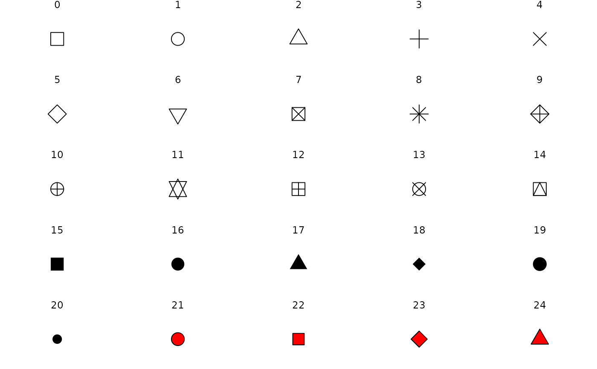

```{r setup, include=FALSE}
knitr::opts_chunk$set(echo = TRUE)
```

<br>

# Importer les données
```{r}
library(datasets)
data(iris)
```

<br>

# Exploration de données

Avant de débuter des analyses, il est important de se familisariser avec son
jeu de données afin d'avoir une idée de sa structure. Cette étape permet
d'identifier des motifs, des tendances ou des relations préalablement aux tests 
statistiques, puis de vérifier la qualité des données. Elle permet aussi d'évaluer
si les données ont besoin d'être transformées avant de procéder aux analyses.

## Quelques fonctions de base

Pour vérifier le nombre de lignes et de colonnes de votre *dataset*:
```{r}
dim(iris)
```

Pour voir les 6 premières lignes du jeu de données:
```{r}
head(iris)
```

Pour connaître le nom des colonnes:
```{r}
names(iris)
```

Pour vérifier la classe de chaque variable dans le *dataset*:
```{r}
str(iris)
```

Pour obtenir certaines statistiques descriptives de base, telles que le minimum, 
le maximum puis la moyenne (variables continues), ainsi que le nombre 
d'observations (variables catégoriques):
```{r}
summary(iris)
```


Pour oconnaître les niveaux d'une variable catégorique:
```{r}
levels(iris$Species)
```

<br>

## Visualisation d'un jeu de données

La fonction `plot()` est une fonction versatile qui permet de créer une grande
variété de figures avec les données brutes. Dépendemment du type de donnée et des arguments fournis à la fonction, `plot()` peut générer plusieurs types de figures comme:

Une seule matrice de *scatterplots* figure peut être créée avec toutes les variables 
continues.
```{r}
plot(iris)
```

Pour créer un *scatterplot* de la relation entre une variable spécifique et une autre,
il suffit d'entrer celles-ci dans la fonction, séparées par le signe **~**. Par 
exemple, si on veut visualiser la relation entre la longueur des sépales et celle 
des pétales dans le jeu de données `iris`, on peut l'écrire ainsi:

```{r}
plot(iris$Sepal.Length~iris$Petal.Length)
```

À l'aide de la fonction `boxplot()`, on peut visualiser la dispersion d'une variable selon dles groupes d'une variable catégorique. Ce type de figure permet aussi d'identifier rapidement des valeurs aberrantes ou des anomalies. 

```{r}
boxplot(iris$Petal.Length~iris$Species)
```

La fonction `hist()` génère un histogramme de la variable qui y est précisée.

```{r}
hist(iris$Sepal.Width)
```

<br>

# Conseils pour des figures et tableaux réussis

Les figures sont des représentations visuelles des résultats. Elles rendent la lectures des résultats principaux plus facile et permettent de mettre en évidence des tendances ou motifs intéressants. On veut pouvoir la comprendre sans avoir à osciller entre la figure et le texte. Elles doivent contenir:

+ **Un titre descriptif**: les variables mesurées, les unités de mesure, le nom commun et en latin du taxon (si nécessaire). Le titre doit fournir assez d'information pour qu'on comprenne le contexte de la figure sans devoir se référer au texte.

+ **Titre des axes**: doivent comprendre la variable et son unité de mesure

+ **Barres d'erreurs**: les inclure pour indiquer l'écart-type autour de la moyenne

+ **Légende**: une petite légende peut être nécessaire pour distinguer les traitements (couleur, type de ligne, etc.)

+ **Indice de significativité**: la valeur p d'une relation, des astérisques au-dessus de graphes à barres pour indiquer si la relation est significative, etc.

Les tableaux sont un bon choix pour présenter de l'information numérique détaillée. Ils présentent habituellement des résultats plus complexes qui seraient trop encombrants à inclure dans une figure ou dans le texte. Généralement, si les données ne peuvent être présentées en une ou deux phrases, un tableau est nécessaire. Les lignes et les colonnes doivent contenir le nom de la variable ainsi que l'unité de mesure. Un tableau résumé des statistiques peut inclure, par exemple, la moyenne, l'écart-type, les intervalles de confiances, les degrés de liberté, la valeur p et autres statistiques (comme la *F value*).


## Légende d'une figure ou d'un tableau
Les légendes servent à compléter l'information qui est présentée dans le tableau ou la figure. On y retrouve entre autre les tailles d'échantillons (n), valeur p, des descriptions des abréviations, la méthode de collection, le nombre de réplicats, etc.

## Annexe ou pas?
Les données ou les figures qui ne contribuent pas directement à l'histoire principale de votre rapport peuvent être rassemblées en annexes. Dans cette section, on peut retrouver, par exemple, des cartes du site d'échantillonnage, du matériel utilisé pour récolter les données, des tableaux avec davantage d'informations sur les modèles (pas de capture d'écran du *summary*!), etc.


<br>

# Coder des graphiques avec ggplot (Sabrina)

## Observer la stucture des données univariées
```{r}
summary(iris)
```

# ANOVA (Sabrina)
La fonction de base `plot()` peut être utile pour visualiser rapidement un jeu de données, par exemple avec un histogramme. Par contre, vous verrez que son utilisation peut devenir  limitée lorsqu'il s'agit de réaliser des figures plus complexes ou simplement modifier certains paramètres graphiques. 

C'est pour cela que nous suggérons d'utiliser la fonction `ggplot()`, du package "ggplot2". Cette fonction permet de réaliser des graphiques de façon plus intuitive et permet de les mettre en page plus facilement qu'avec la fonction `plot()`. Elle est aussi mieux documentée, il est donc plus facile de comprendre et utiliser les différents aspects de la fonction. Google est d'ailleurs votre meilleur allié pour la réalisation de vos figures!

Contrairement à la fonction `plot()`, `ggplot()` fonctionne par couches. 
Une figure `ggplot()` commence avec la fonction `ggplot()`. Elle sert à "préparer" la figure: on spécifie le jeu de données à utiliser, puis on choisit les variables qui formeront nos axes. 

La fonction `ggplot()` nécessite deux arguments: le dataset (jeu de données), puis l'argument `aes()`. Ce dernier nous permet d'assigner des variables du dataset aux composantes du graphique (par exemple, les axes x et y). Voici un exemple, toujours avec le jeu de données Iris. Nous allons tester si la largeur des sépales diffère entre les espèces.

(Revoir l'atelier 3 pour l'explication de l'ANOVA, incluant les postulats et critères d'utilisation, que je passe ici)

```{r}
library("ggplot2")

head(iris)

boxplot(Sepal.Width ~ Species,
  data = iris)
```

On produit d'abord le modèle linéaire, et le test d'ANOVA, avec `Sepal.Width` comme variable dépendante et `Species` comme variable indépendante.

```{r}
modele.SW<-lm(Sepal.Width~Species,data=iris)

#Test anova:
anova(modele.SW)
summary(modele.SW)

# [[[ Commentaire anova ]]]
```

Ensuite, on effectue le test post-hoc Tukey:

```{r}
compSW<-aov(Sepal.Width~Species,data=iris)
TukeyHSD(compSW)
summary(compSW)

# [[[ Commentaire Tukey ]]]
```

On peut ensuite construire notre figure.
D'abord, la fonction `ggplot()`. On spécifie le jeu de données, puis l'argument `aes()`, ici les axes x et y:

```{r}
ggplot(iris, aes(x=Species, y=Sepal.Width))
```

Où sont les données?
Il faut les ajouter!

C'est comme ça que `ggplot()` fonctionne. On crée la base de notre figure, puis on y ajoute les données à l'aide des fonctions `geom_*`. Par exemple, `geom_points` nous permet d'ajouter des données sous forme de scatterplots (donc des points), tandis que `geom_line` nous permet d'ajouter une ligne. Dans notre cas, nous voulons montrer nos données sous forme de boxplot, donc nous utilisons `geom_boxplot`. Il ne faut pas oublier d'ajouter un `+` après chaque fonction:

```{r}
ggplot(iris, aes(x=Species, y=Sepal.Width)) +
geom_boxplot()
```


Pour ajouter/modifier d'autres éléments, il faut ajouter des couches. Ainsi, on peut changer les titres d'axes (labs pour labels), changer le thème de notre graphique (`theme_bw` est plus minimaliste), retirer la grille et centrer le titre:

```{r}
ggplot(iris, aes(x=Species, y=Sepal.Width)) +
geom_boxplot()+
labs(	x="Espèce", 
	y="Largeur des sépales (cm)",
	title="Largeur des sépales chez les espèces d'iris")+
theme_bw()+
theme(panel.grid.major = element_blank(), panel.grid.minor = element_blank())
```


On peut aussi décider de changer les couleurs. Ce n'est pas toujours nécessaire ou pertinent, si ça n'ajoute pas d'information à la figure. Il faut faire attention de ne pas surcharger la figure avec le design esthétique, l'important c'est de focuser sur le message que l'on veut transmettre avec notre figure, et ne pas ajouter d'éléments qui sont distrayants. Mais pour l'exercice et se familiariser avec les paramètres graphiques, essayons:

```{r}
ggplot(iris, aes(x=Species, y=Sepal.Width)) +
geom_boxplot(fill = "salmon", color = "red")+
labs(	x="Espèce", 
	y="Largeur des sépales (mm)",
	title="Largeur des sépales chez les espèces d'iris")+
theme_bw()+
theme(panel.grid.major = element_blank(), panel.grid.minor = element_blank()) 
```

On a donc changé le `fill` (intérieur) et `color` (trait) de nos boxplot, à même la fonction `boxplot()`.
On pourrait aussi changer la couleur des boîtes en fonction de l'espèce d'iris (qui est aussi notre variable x). Dans ce cas, il faut ajouter un argument `aes()` à la fonction `boxplot()`, pour assigner notre variable à un aesthetic. Ce sera notre variable `Species`:

```{r}
#Fill:

ggplot(iris, aes(x=Species, y=Sepal.Width)) +
geom_boxplot(aes(fill=Species), show.legend = FALSE)+
labs(	x="Espèce", 
	y="Largeur des sépales (mm)",
	title="Largeur des sépales chez les espèces d'iris")+
theme_bw()+
theme(panel.grid.major = element_blank(), panel.grid.minor = element_blank()) 

#Color:
ggplot(iris, aes(x=Species, y=Sepal.Width)) +
geom_boxplot(aes(color=Species), show.legend = FALSE)+
labs(	x="Espèce", 
	y="Largeur des sépales (mm)",
	title="Largeur des sépales chez les espèces d'iris")+
theme_bw()+
theme(panel.grid.major = element_blank(), panel.grid.minor = element_blank()) 
```


Il y a aussi des palettes de couleurs prédéfinies dans R, qu'on peut utiliser avec la fonction `scale_fill_brewer` (j'ai choisi la palette "Accent"):

```{r}
ggplot(iris, aes(x=Species, y=Sepal.Width)) +
geom_boxplot(aes(fill=Species), show.legend=FALSE)+
scale_fill_brewer(palette="Accent")+
labs(	x="Espèce", 
	y="Largeur des sépales (mm)",
	title="Largeur des sépales chez les espèces d'iris")+
theme_bw()+
theme(panel.grid.major = element_blank(), panel.grid.minor = element_blank())

#Qu'est-ce qui arrive si on change Fill pour Color, dans boxplot()? Il faut aussi changer scale_fill_brewer() pour scale_color_brewer():

ggplot(iris, aes(x=Species, y=Sepal.Width)) +
geom_boxplot(aes(color=Species), show.legend=FALSE)+
scale_color_brewer(palette="Accent")+
labs(	x="Espèce", 
	y="Largeur des sépales (mm)",
	title="Largeur des sépales chez les espèces d'iris")+
theme_bw()+
theme(panel.grid.major = element_blank(), panel.grid.minor = element_blank())
```

Puisque `ggplot()` fonctionne par couche, on peut aussi choisir d'ajouter les données brutes à notre figure. Par exemple, on ajoute avant `geom_boxplot()` une autre couche de données avec `geom_point()`, dans lequel on peut spécifier, encore une fois, l'argument `aes()` pour assigner la variable qui sera colorée. L'argument position définit le niveau de "jitter", c'est-à-dire des points un peu "éparpillés" sur l'axe x. Ensuite, on pourrait ajouter l'argument `alpha=0.5` dans la fonction `boxplot()`, pour les rendre semi-transparents:

```{r}
ggplot(iris, aes(x=Species, y=Sepal.Width)) +
geom_point(aes(color=Species), position = position_jitter(0.2), shape = 16, size = 2.5, show.legend=FALSE)+
scale_color_brewer(palette="Accent")+
geom_boxplot(alpha=0.5)+
labs(	x="Espèce", 
	y="Largeur des sépales (mm)",
	title="Largeur des sépales chez les espèces d'iris")+
theme_bw()+
theme(panel.grid.major = element_blank(), panel.grid.minor = element_blank(), plot.title = element_text(hjust = 0.5))
```

On peut aussi ajouter des lettres pour montrer nos résultats de comparaison (voir https://statdoe.com/one-way-anova-and-box-plot-in-r/ pour la méthode). En gros, la fonction `multcompLetters4` assigne les lettres en fonction des groupes du test de Tukey, puis on constuit une table qui contient ces lettres (`LettresSW` dans l'exemple), la variable `Species`, ainsi que la position de la lettre (en haut du quartile pour chaque boîte/valeur de `Species`).  

```{r}
library(dplyr)
library(multcompView)

compSW<-aov(Sepal.Width~Species,data=iris)
tukeySW <- TukeyHSD(compSW)
print(tukeySW)

cld <- multcompLetters4(compSW, tukeySW)

LettresSW <- group_by(iris, Species) %>%
  summarise(mean=mean(Sepal.Width), quant = quantile(Sepal.Width, probs = 0.75)) %>%
  arrange(desc(mean))

cld <- as.data.frame.list(cld$Species)
LettresSW$cld <- cld$Letters

print(LettresSW)
```

On ajoute nos lettres au boxplot avec la fonction `geom_text()`, avec comme argument `aes()` la table que l'on vient de créer. On peut aussi ajouter la statistique de test avec la fonction `annotate()`, en utilisant les coordonnées x et y dans notre figure.

```{r}
ggplot(iris, aes(x=Species, y=Sepal.Width)) +
geom_point(aes(color=Species), position = position_jitter(0.1), shape = 16, size = 2.5, show.legend=FALSE)+
scale_color_brewer(palette="Accent")+
geom_boxplot(alpha=0.5)+
labs(	x="Espèce", 
	y="Largeur des sépales (mm)",
	title="Largeur des sépales chez les espèces d'iris")+
theme_bw()+
theme(panel.grid.major = element_blank(), panel.grid.minor = element_blank(), plot.title = element_text(hjust = 0.5))+
geom_text(data = LettresSW, aes(x = Species, y = quant, label = cld), size = 5, vjust=-1, hjust =-5)+
annotate("text", x = 3, y = 4.5, label = "ANOVA, F(2)=49.16, p<0.001")
```

Pour bien faire, on pourrait même changer les étiquettes en x. Avec la fonction `scale_x_discrete`, j'ajoute "I." pour iris à chaque étiquette et je les mets en italique, puisque ce sont des noms latins, avec l'argument `axis.text.x` dans la fonction `theme()`. 

```{r}
ggplot(iris, aes(x=Species, y=Sepal.Width)) +
geom_point(aes(color=Species), position = position_jitter(0.1), shape = 16, size = 2.5, show.legend=FALSE)+
scale_color_brewer(palette="Accent")+
geom_boxplot(alpha=0.5)+
labs(	x="Espèce", 
	y="Largeur des sépales (mm)",
	title="Largeur des sépales chez les espèces d'iris")+
theme_bw()+
theme(panel.grid.major = element_blank(), panel.grid.minor = element_blank(), plot.title = element_text(hjust = 0.5), axis.text.x = element_text(face="italic"))+
geom_text(data = LettresSW, aes(x = Species, y = quant, label = cld), size = 5, vjust=-1, hjust =-5)+
annotate("text", x = 3, y = 4.5, label = "ANOVA, F(2)=49.16, p<0.001")+
scale_x_discrete(labels=c("I. setosa", "I. versicolor", "I. virginica"))
```

# Régression linéaire (Sabrina)


# Autres modèles univariés... (Sabrina, à voir si c'est pertinent)


# Ordinations

Comme pour les analyses univariées, cet atelier est seulement axé sur la création de graphiques. Pour une introduction aux analyses multivariées (ordinations, PERMANOVA, Procrustes), consulter l'atelier 6.

## Importer les données multivariées
```{r}
library(vegan)
data(dune) # matrice de communautés
data(dune.env) # données environnementales
```

Ce jeu de données contient une matrice d'abondance (dune) d'espèces végétales avec leur classe de couverture pour 20 sites. Le dataframe (dune.env) contient 5 variables denvironnementales.

# PCA et PERMANOVA

Transformation Hellinger
```{r}
dune.hel <- decostand(dune, method="hellinger")
```

Faire une PCA (avec la fonction `prcomp` cette fois-ci, car l'objet qu'on va créer peut être "lu" plus tard par la fonction `ggord`)
```{r}
pca.dune <- prcomp(dune.hel)
summary(pca.dune)
```

Dans l'atelier 6, nous avons fait nos PCA avec la fonction `rda`. Lorsqu'on compare le sommaire des deux analyses, on voit que les deux fonctions donnent les mêmes résultats.
```{r}
pca2.dune <- rda(dune.hel)
summary(pca2.dune)
```

PERMANOVA. On va tester si la composition végétale diffère entre différents type d'aménagement (facteur; variable quantitative) des sites.
```{r}
dune.dist <- vegdist(decostand(dune, method='hellinger'), method='euclid')
disper.dune <- betadisper(dune.dist, dune.env$Management)
anova(disper.dune)
permanova.dune <- adonis2(dune.dist ~ Management, data = dune.env)
permanova.dune
```

Le test montre que le type d'aménagement a un effet statistiquement significatif sur la composition en espèces végétales des sites.

## Graphique pour présenter la PCA avec les différents types d'aménagement.

Extraire les scores des sites et des espèces, à partir de l'objet créer par `prcomp`. Cela va nous permettre de mettre éventuellement seulemenet les espèces désirées sur le graphique.
```{r}
site.scores<-pca.dune$x 
site.scores.df <- data.frame(site.scores)
sp.scores<-pca.dune$rotation
sp.scores.df <- data.frame(sp.scores)
```

Ouverture des librairies nécessaires à la création du graphique.
Si problème avec installation de la librairie ggord : https://rdrr.io/github/fawda123/ggord/
```{r}
library(ggord)
library(ggplot2)
library(ggrepel) # pour éviter overlap du texte
```

On va d'abord commencer le graphique avec la fonctions `ggord` du package du même nom.

Le graphique créé par la fonction `ggord` est un objet ggplot. Cet objet (ici appelé pca.plot) peut être personnalisé à même la fonction `ggord`, et peut aussi servir de base sur laquelle ajouter des couches avec ggplot.
```{r}
pca.plot <- ggord(pca.dune, xlims=c(-1,1), ylims=c(-1,1)) # xlims et ylims définissent les limites dans l'affichage des axe (les valeurs entre parenthèses correspondent à l'échelle numérique des axes). On ajuste au fur et à mesure, au besoin.
pca.plot # À la fin de chaque chunk, l'objet graphique est appelé pour qu'on visualise le rendu à chaque fois.
```
On remarque que la fonction`ggord` inclut par défaut la **proportion de la variance expliquée par les axes**. C'est super!

Par défaut, la fonction `ggord` va mettre en graphique les deux premiers axes de l'ordination. Mais si on s'intéresse à différents axes, on peut spécifier lesquels mettre en graphique.
```{r}
pca.plot <- ggord(pca.dune, xlims=c(-1,1), ylims=c(-1,1),
                  axes=c(1,3)) # Ici, on met en graphique les axes 1 et 3.
pca.plot
```

On revient aux deux premiers axes. Faisons quelques petits changements. Les changements sont marqués d'un "#" à côté de la ligne.
```{r}
pca.plot <- ggord(pca.dune, xlims=c(-1.2,1.4), ylims=c(-0.75,0.9), # ajustement des limites
                  axes=c(1,2), # retour aux axes 1 et 2
                  size=3, # diminution de la taille des points (sites)
                  arrow=NULL,# enlever les flèches (qui viennent par défaut) pour les espèces
                  labcol="forestgreen") # changer la couleur du texte pour les espèces
pca.plot
```

Faisons d'autres changements!
```{r}
pca.plot <- ggord(pca.dune, xlims=c(-1.2,1.4), ylims=c(-0.75,0.9), 
                  axes=c(1,2), 
                  size=3, 
                  obslab=TRUE, # pour passer de points pour les sites (par défaut) à texte (nom des sites)
                  arrow=NULL,
                  labcol="forestgreen") # changer la couleur du texte pour les espèces
pca.plot
```

Il y a beaucoup d'espèces affichées au milieu et c'est illisible. En plus, les espèces au milieu ne contribuent pas beaucoup à la distinction compositionnelle des sites. On va donc garder seulement les quelques espèces dont les scores ont la valeur absolue la plus élevée, pour chacun des deux axes, qu'on met en graphique (ici PC1 et PC2).

D'abord, on va créer un nouveau dataframe contenant seulement ces espèces, en utilisant quelques fonctions de la librairie **dplyr**.
```{r}
A <- top_n(sp.scores.df, 3, PC1) # sélectionne les 3 espèces dont le score est le plus élevé sur l'axe 1.
B <- top_n(sp.scores.df, -3, PC1) # sélectionne les 3 espèces dont le score est le plus bas sur l'axe 1.
C <- top_n(sp.scores.df, 3, PC2) # sélectionne les 3 espèces dont le score est le plus élevé sur l'axe 2.
D <- top_n(sp.scores.df, -3, PC2) # sélectionne les 3 espèces dont le score est le plus bas sur l'axe 2.
sp.scores.skim <- bind_rows(A,B,C,D) # merge les sub dataframe A, B, C et D.
sp.scores.skim <- distinct(sp.scores.skim) # on ne garde que les rangées (espèces) qui sont uniques (pour éviter qu'une même espèce s'y retrouve en copies)
```

Mise en graphique de ces espèces seulement
```{r}
pca.plot <- ggord(pca.dune, xlims=c(-1.2,1.4), ylims=c(-0.75,0.9), 
                  axes=c(1,2), 
                  size=3, 
                  obslab=TRUE,
                  arrow=NULL,
                  txt=NULL, # enlever le texte (par défaut) pour les espèces
                  addpts=sp.scores.skim, # Ajouter les espèces aux plus hauts et faibles scores
                  addsize=3, # taille des points des espèces
                  addcol="forestgreen") # couleur des espèces
                  # on enlève l'argument labcol
pca.plot
```
```{r}
pca.plot <- ggord(pca.dune, xlims=c(-1.2,1.4), ylims=c(-0.75,0.9), 
                  axes=c(1,2), 
                  size=3, 
                  obslab=TRUE,
                  arrow=NULL,
                  txt=NULL, 
                  addpts=sp.scores.skim, 
                  addsize=4, # augmenter la taille du texte des espèces
                  ptslab=TRUE, # changer de points à texte pour les espèces
                  addcol="forestgreen")
pca.plot
```

On va ajouter les résultats d'un `envfit`. D'abord, on fait le test.
```{r}
(pca.envfit <- envfit(pca.dune, dune.env))
```

Pour incorporer les vecteurs résultant de ce test, il faut d'abord les extraire et les mettre dans un dataframe.
```{r}
vect <- data.frame(pca.envfit[["vectors"]][["arrows"]])
vect$variable.env<-rownames(vect)
```


```{r}
pca.plot <- ggord(pca.dune, xlims=c(-1.2,1.4), ylims=c(-0.75,0.9), 
                  axes=c(1,2), 
                  size=3, 
                  obslab=TRUE,
                  arrow=NULL,
                  txt=NULL, 
                  addpts=sp.scores.skim, 
                  addsize=4, 
                  ptslab=TRUE, 
                  addcol="forestgreen")
pca.plot + 
  coord_fixed() +
  geom_segment(data = vect,
               aes(x = 0, xend = PC1, y = 0, yend = PC2),
               arrow = arrow(length = unit(0.5, "cm")), colour = "darkgrey") +
  geom_text_repel(data = vect, aes(x = PC1, y = PC2, label = variable.env, size = 3), show.legend = FALSE)
```

Maintenant, on va ajouter des ellipses autour des sites appartenant à des groupes similaires. On va aussi revenir à des symboles au lieu du nom des sites et changer la couleur du texte des espèces.
```{r}
pca.plot <- ggord(pca.dune, xlims=c(-1.2,1.4), ylims=c(-0.75,0.9),
                  axes=c(1,2),
                  grp_in=dune.env$Management, # ajout des ellipses en fonction du type de Management
                  grp_title = "Management",
                  ellipse_pro=0.95, # valeur de confiance pour les ellipses
                  alpha_el=0.3, # transparence des ellipses
                  size=3, 
                  obslab=FALSE, # changement de texte à points pour sites
                  arrow=NULL,
                  txt=NULL, 
                  addpts=sp.scores.skim, 
                  addsize=4, 
                  ptslab=TRUE,
                  addcol="black", # couleur des espèces
                  alpha = 1)
pca.plot + 
    scale_shape_manual('Groups', values = c(15,16,17,18)) + # Symboles pour les espèces en fonction de leur groupe. Assurer vous d'avoir un nombre de symboles correspondant au nombre de groupes.
    coord_fixed() +
    geom_segment(data = vect,
               aes(x = 0, xend = PC1, y = 0, yend = PC2),
               arrow = arrow(length = unit(0.5, "cm")), colour = "darkgrey") +
    geom_text_repel(data = vect, aes(x = PC1, y = PC2, label = variable.env, size = 3), show.legend = FALSE)

```

Voici une légende indiquant quels symboles sont associées aux différentes valeurs numériques de la couche `scale_shape_manual`.



Changer les couleurs des groupes
On va extraire les codes des couleurs d'une palette de R ColorBrewer avec la fonction `brewer.pal`
```{r}
library(RColorBrewer)
pca.colors <- brewer.pal(n = 4, name = "Dark2") # Hexadecimal color specification 
```

Et on va incorporer ces codes de couleurs dans un argument et on déplace la légende vers le haut.
```{r}
pca.plot <- ggord(pca.dune, xlims=c(-1.2,1.4), ylims=c(-0.75,0.9),
                  axes=c(1,2),
                  grp_in=dune.env$Management, 
                  grp_title = "Management",
                  cols=pca.colors, # ajout des couleurs choisies
                  ellipse_pro=0.95,
                  alpha_el=0.3,
                  size=3, 
                  obslab=FALSE, 
                  arrow=NULL,
                  txt=NULL, 
                  addpts=sp.scores.skim, 
                  addsize=4, 
                  ptslab=TRUE,
                  addcol="black",
                  alpha = 1)
pca.plot <- pca.plot + # ici j'enregistre l'ensemble des arguments précédents et suivants dans mon objet pca.plot.
    scale_shape_manual('Groups', values = c(15,16,17,18)) + 
    coord_fixed() +
    geom_segment(data = vect,
               aes(x = 0, xend = PC1, y = 0, yend = PC2),
               arrow = arrow(length = unit(0.5, "cm")), colour = "darkgrey") +
    geom_text_repel(data = vect, aes(x = PC1, y = PC2, label = variable.env, size = 3), show.legend = FALSE)+
    theme(legend.position = 'top') # mettre la légende en haut
pca.plot
```

Créer un thème custom pour ggplot.
```{r}
super_theme <- theme(
        panel.background = element_blank(),
        #panel.border = element_blank(),
        panel.grid = element_blank(),
        axis.line = element_line("gray25"),
        text = element_text(size = 12),
        axis.text = element_text(size = 10, colour = "gray25"),
        axis.title = element_text(size = 14, colour = "gray25"),
        legend.title = element_text(size = 14),
        legend.text = element_text(size = 14),
        legend.key = element_blank())
```

Ajouter ce thème au graphique.
```{r}
pca.plot + super_theme
```

On va rajouter du texte!
```{r}
pca.plot + annotate("text", x = 1.1, y = 0.7, label = "PERMANOVA\nR2=30%\n p=0.007") +
    super_theme
```

Satisfait? On sauvegarde l'image en png. Par défaut, ggplot enregistre le dernier graphique créé. Ici je copie-colle mon code de graphique ci haut, puis sauvegarde ce graphique avec la fonction `ggsave`.
```{r}
pca.plot + annotate("text", x = 1.1, y = 0.7, label = "PERMANOVA\nR2=30%\n p=0.007") +
    super_theme
ggsave("pca.png", path="./figures/")
```

Cet atelier n'est pas fait pour vous montrer à utiliser une esthétique particulière, mais bien pour vous familiariser avec les options (infinies...) permettant de personnaliser un graphique d'ordination. Amusez-vous les artistes!!

# CA


Ordination
```{r}
#varespec.hel <- decostand(varespec, method="hellinger") # Tranformation hellinger des données
#pca.varespec <- rda(varespec.hel) # PCA
#summary(pca.varespec)
```
envfit
```{r}
#(envfit.pca <- envfit(pca.varespec, varechem))
```

Les fonctions `biplot` est très simple et parfait pour créer rapidement des graphiques afin d'explorer nos données.
```{r}
#biplot(pca.varespec)
```

On peut personnaliser le biplot pour le rendre plus compréhensible, mettre en valeur certains éléments et le rendre plus esthétique.
```{r}
#make basic plot
#biplot(pca.varespec, display = c("sites", "species"), type = c("text","points"))


#Add hulls
#ordihull(my.rda,
#         group = iris$Species,
#         col = c(1,2,3))

#get names of species
## levels() extracts fator levels
## from the column
#spp.names <- levels(iris$Species)

#Add legend
#legend("topright",
#       col = c(1,2,3), 
#       lty = 1,
#       legend = spp.names)
```

fonction `ordiplot`...
```{r}

```


```{r}
#pca2.varespec <- prcomp(varespec)
```


D'abord, on doit créer un graphique de base pour en extraire les informations.


```{r}
#plotA <- ordiplot(pca.varespec)
```


```{r}
#plotgg1 <- ggplot() + 
 #   geom_vline(xintercept = c(0), color = "grey70", linetype = 2) +
  #  geom_hline(yintercept = c(0), color = "grey70", linetype = 2) +  
   # xlab("PCA 1") +
    #ylab("PCA 2") +  
    #scale_x_continuous(sec.axis = dup_axis(labels=NULL, name=NULL)) +
    #scale_y_continuous(sec.axis = dup_axis(labels=NULL, name=NULL)) +    
    #geom_point(data=sites.scores)
  
#plotgg1
```


```{r}
#ggplot(pca.varespec)
```


## CA (Analyse de correspondance)

Faire l'ordination
```{r}
#ca.varespec<-cca(varespec)
```
Tests statistiques avec la fonction **envfit**
```{r}
#envfit.varechem<-envfit(ca.varespec, varechem)
```

### Fonction plot

```{r}
#plot(ca.varespec)
```

On pourrait aussi choisir de ne visualiser que les sites ou que les espèces.
```{r}
#par(mfrow = c(1, 2))
#plot(ca.varespec, display = "sites")
#plot(ca.varespec, display = "species")
```

```{r}
#par(mfrow=c(1,2))
#plot(ca.varespec, scaling=1, type="none", main='CA - biplot scaling 1', 
#     xlab=c("CA1 (%)", round((ca.varespec$CA$eig[1]/sum(ca.varespec$CA$eig))*100,2)),
#     ylab=c("CA2 (%)", round((ca.varespec$CA$eig[2]/sum(ca.varespec$CA$eig))*100,2)))
#points(scores(ca.varespec, display="sites", choices=c(1,2), scaling=1), pch=21, col="black", bg="steelblue", cex=1.2)
#text(scores(ca.varespec, display="species", choices=c(1), scaling=1),
#     scores(ca.varespec, display="species", choices=c(2), scaling=1),
#     labels=rownames(scores(ca.varespec, display="species", scaling=1)),col="red", cex=0.8)
```

Incorporer les vecteurs environnementaux à la figure d'ordination
```{r}
#plot(ca.varespec, display = "sites")
#plot(envfit.varechem)
#plot(envfit.varechem, p.max = 0.05, col = "red")#Les correlations significatives apparaissent en rouge
```


### Fonction ordiplot
```{r}
#ordiplot(ca.varespec)
```

```{r}
#pl <- ordiplot(ca.varespec, type = "none", 
               #xlab=c("CA1", round((ca.varespec$CA$eig[1]/sum(ca.varespec$CA$eig))*100, 2)), 
               #ylab = "PC2 (16,1%)")
#points(pl, "sites", pch=21, col="black", bg="forestgreen")
#text(pl, "species", col="black", cex=0.9)
#text(pl, "species", col="black", cex=0.9, 
#     select = c("a.PRPE","a.ACSP","a.COCO","A.BEAL","h.RUID","h.ABBA","h.COCO","h.COCA","h.VILA","a.ACSA","a.ABBA","a.ALRU","A.BEPA","A.ABBA","h.DRIN"))
#ordihull(pca_comm, env_scaled$milieu, label = T, draw ="polygon", col=c("darkgreen","grey"), alpha=0.4, lwd = 1, kind=sd)
```


## PCA

### Fonction biplot

La fonction biplot ne peut être qu'utilisée avec ordination linéaire comme PCA.

--> afficher d'autres axes que 1 et 2....
--> afficher les espèces aux scores élevés
--> envfit
